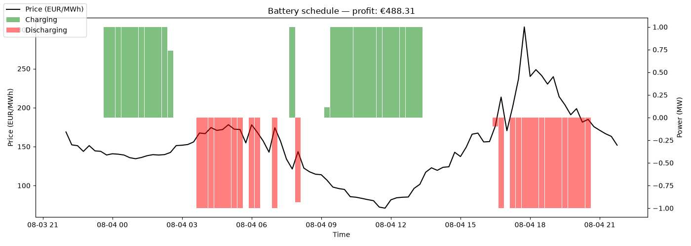
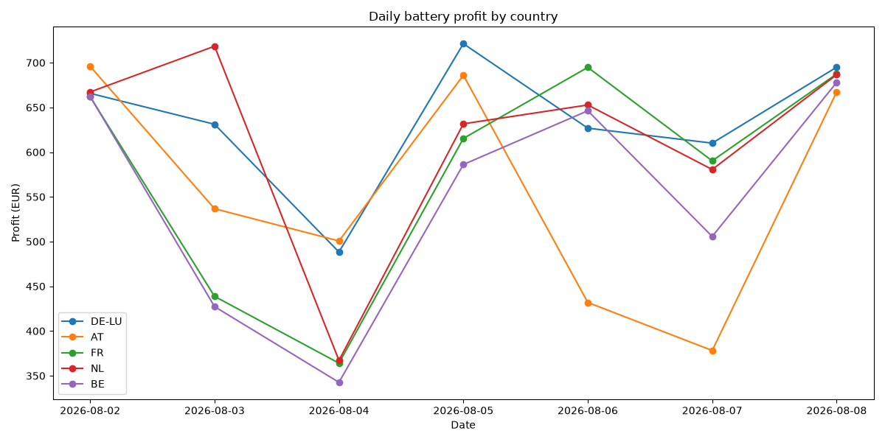
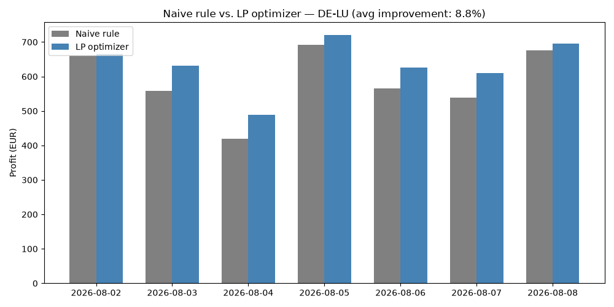

# Battery Dispatch Optimizer

A linear programming model that finds the profit-maximizing charge/discharge
schedule for a grid-scale battery, given real European day-ahead electricity
prices. Built with `scipy.optimize.linprog`, backtested against real historical
data, and benchmarked against a naive rule-based strategy.

This project uses price data collected by a separate pipeline
([electricity-price-pipeline](https://github.com/simin-tan/electricity-price-pipeline)) —
sample data is included here so this repo runs standalone.

## Structure
- `src/optimize.py` — battery charge/discharge optimization via `scipy.optimize.linprog`
- `src/baseline.py` — naive rule-based strategy, used as a comparison baseline
- `src/backtest.py` — runs the optimizer across all available days, per country, and compares results
- `tests/test_optimize.py` — unit tests for the optimizer's core logic
- `data/processed/` — sample daily price data (Parquet), used for the examples below

## Setup
```
python -m venv .venv
.venv\Scripts\Activate.ps1
pip install -r requirements.txt

python src/optimize.py # run battery optimization on a chosen day
python src/backtest.py # run backtest across all countries and days
python src/baseline.py # compare against naive strategy
pytest tests/ -v # run the test suite
```

## Example output

Battery schedule for Aug 4, 2026, using specs matching a single Tesla Megapack 2
unit (3.9 MWh capacity, 1 MW power, ~93.7% round-trip efficiency). The battery
starts empty and is constrained to end the day with at least as much charge as
it started with.



Optimizer correctly identifies price troughs to charge and price peaks to
discharge, yielding €488 theoretical profit for the day.

**Limitations of this example:**
- Assumes perfect foresight of the full day's prices. A realistic deployment
  would need to re-optimize on a rolling basis, using only prices known at
  each point in time (day-ahead auctions close ~1 day before delivery).
- Ignores battery degradation costs, which would reduce real-world profitability
  over many charge/discharge cycles.
- A production strategy would be backtested across many days and market
  conditions before being trusted.

## Multi-country comparison

Running the same backtest across 5 European bidding zones (Aug 2-8, 2026):



| Country | Avg. daily profit | Total (7 days) |
|---------|-------------------|-----------------|
| DE-LU   | €634.03            | €4,438.21       |
| NL      | €614.90            | €4,304.32       |
| FR      | €578.91            | €4,052.39       |
| AT      | €556.65            | €3,896.56       |
| BE      | €549.74            | €3,848.15       |

DE-LU shows the highest average arbitrage profit, plausibly reflecting Germany's
high renewable energy share (wind/solar), which tends to produce more volatile
day-ahead prices — and more volatility means more opportunity for battery arbitrage.
This is a small, early sample (7 days); a longer backtest would be needed to
confirm this pattern holds over different seasons and weather conditions.

## Optimization vs. naive strategy

How much better is the LP optimizer than a simple rule-based approach
("charge when price is in the bottom 25%, discharge when price is in the
top 25%")? Comparing both strategies on DE-LU across the same 7 days:



The LP optimizer beats the naive rule on every single day tested, averaging
**8.8% higher profit**. The gap is largest on more volatile days, since a
fixed-threshold rule can't adapt to the specific shape of each day's price
curve the way a full-day optimization can.

## Limitation: single-day optimization horizon

Carrying a battery's ending charge into the next day (rather than resetting
to empty) was tested and found to have no effect on total profit. This is a
structural consequence of optimizing each day independently: since all
observed prices are positive and the model assigns no value to unsold charge
at the end of the horizon, it is always optimal to sell down to zero charge
by day's end, regardless of the starting level. This was confirmed with a
constructed test case — a battery starting half-full, with a price spike
limited to the first hour and low prices thereafter — in which the optimizer
still liquidated to ~0 MWh rather than holding charge in reserve.

Addressing this would require optimizing across multiple days within a
single solve, allowing the model to value held charge against future prices
rather than only those within the current day. This increases problem size
and solve time as the horizon extends, and is a natural direction for
further work.

## Possible next steps

- Multi-day (rather than single-day) optimization horizon
- Battery degradation modeling for more realistic long-run profitability
- Connect to a live forecast model instead of relying on known historical prices